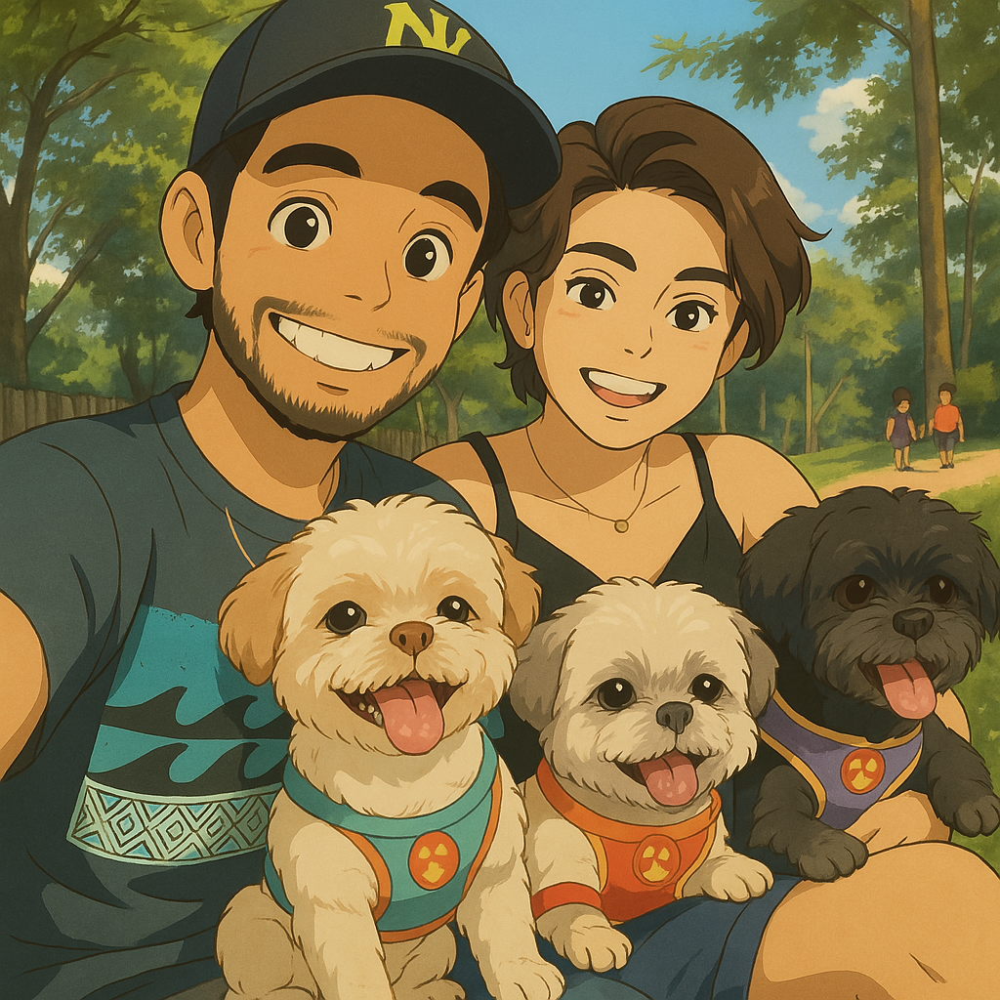

# mae
# Homenagem Interativa de Dia das Mães - "Sempre ao Seu Lado, Mãe"

Uma página feita com amor, criada como surpresa especial para o Dia das Mães — unindo emoção, interatividade, patinhas e corações. Essa homenagem celebra a mãe da família, com uma experiência única vinda de Estrela, Toddy, Simba, Léo (e o papai, claro).

## Demonstração

> **"Sempre ao seu lado, mãe" não é só uma frase. É o que a gente vive todos os dias.**



## Descrição

Este projeto foi criado como uma surpresa emocionante para o Dia das Mães. Ao acessar o site, a mamãe é recebida com:

- Uma tela de boas-vindas com botão de entrada  
- Música de fundo com controle de play/pause  
- Animação com corações flutuando  
- Uma carta linda escrita com efeito de digitação  
- Lista animada com razões do nosso amor  
- Assinatura especial dos filhos de quatro patas  
- Um toque visual leve, sensível e personalizado  

Tudo feito com **HTML, CSS e JavaScript puro**, com foco em amor, interatividade e emoção.

## Funcionalidades

- Tela de boas-vindas com botão de entrada
- Música de fundo com controle de reprodução
- Corações flutuantes animados em tempo real
- Texto digitado automaticamente em formato de carta
- Lista animada de motivos de amor
- Seção com fotos e mensagens dos pets
- Assinatura escrita dinamicamente após a carta
- Animação de estrelas no fundo
- Layout responsivo e visual encantador

## Estrutura do Projeto

```
homenagem-dia-das-maes/
├── index.html
├── assets/
│   ├── css/
│   │   └── style.css
│   ├── js/
│   │   ├── script.js
│   │   └── background-stars.js
│   ├── img/
│   │   ├── background.jpg
│   │   ├── estrela.jpg
│   │   ├── toddy.jpg
│   │   ├── leo.jpg
│   │   └── simba.jpg
│   └── music/
│       └── music.mp3
└── README.md
```

## Tecnologias Utilizadas

- **HTML5**
- **CSS3** (com animações personalizadas)
- **JavaScript** (manipulação de DOM, animações, controle de áudio)

## Como Executar

1. Faça o download ou clone este repositório.
2. Mantenha a estrutura de pastas conforme o exemplo acima.
3. Abra o arquivo `index.html` no navegador.
4. Clique em **"Entrar"** para iniciar a homenagem.

> **Dica:** para uma experiência completa, use fones de ouvido ou som ambiente.

## Personalização

Você pode ajustar:

- Os nomes e fotos dos pets na seção `nossos-pets`.
- A carta personalizada dentro do arquivo `script.js`.
- O array de motivos na lista `reasons[]`.
- A imagem de fundo e a música usada.
- Estilos visuais no `style.css` para combinar com sua estética.

## Créditos

Criado por Davidson Dias com muito carinho como presente para sua esposa — a melhor mãe de quatro patas que seus filhos poderiam ter.

---

**Te amamos mais do que ração (e olha que isso é muito, hein!).**

Estrela, Toddy, Simba, Léo e Papai
